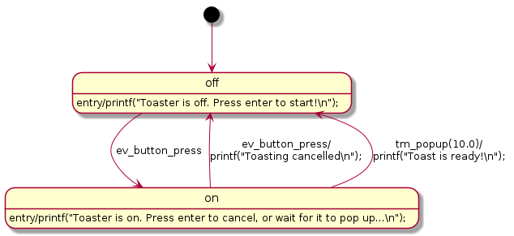

# Vivid State Machine
A cross-platform library for implementing state machines in C/C++ and vividly documenting them in UML.

* The UML diagram reflects the source code - there's no need to maintain it manually.
  * [PlantUML](https://plantuml.com/) state diagrams are generated from the source code.
* Develop and test applications on a PC or in the cloud, then deploy to embedded hardware.
  * Extensible binding layer supports bare-metal uCs, RTOSs including [FreeRTOS](https://freertos.org/),
    as well as Linux and Windows.
## Toaster Example
The following example implements a toaster. For simplicity, it has a 10 second toasting time and the
user presses the same button to start and cancel it.

This diagram was generated from the source code below:



```C
// See examples folder for full source code
VIVID_DECLARE_STATE(root);
VIVID_DECLARE_STATE(off);
VIVID_DECLARE_STATE(on);

VIVID_EVENT_PUBLIC(toaster_t, toaster, ev_button_press, vsm);

VIVID_STATE(toaster_t, root)
{
    VIVID_SUB_STATE(off);
    VIVID_SUB_STATE(on);
    VIVID_DEFAULT(off, VIVID_NO_ACTION);
}

VIVID_STATE(toaster_t, off)
{
    VIVID_ON_ENTRY(printf("Toaster is off. Press enter to start!\n"););
    VIVID_ON_EVENT(ev_button_press, true, on, VIVID_NO_ACTION);
}

VIVID_STATE(toaster_t, on)
{
    VIVID_ON_ENTRY(printf("Toaster is on. Press enter to cancel, or wait for it to pop up...\n"););
    VIVID_ON_EVENT(ev_button_press, true, off, printf("Toasting cancelled\n"););
    VIVID_ON_TIMEOUT(tm_popup, 10.0, true, off, printf("Toast is ready!\n"););
}
```
## Quick Start
### Linux
For Ubuntu, install the prerequisites:
```
sudo apt install build-essential cmake plantuml
```
Clone the repo, then build and run the toaster example:
```
git clone --recursive https://github.com/awslabs/vivid-state-machine.git
cd vivid-state-machine
mkdir build && cd build
cmake -DVIVID_BINDING_LINUX=On -DVIVID_EXAMPLES=On ..
make -j$(nproc)
./examples/toaster/toaster
```
Run `plantuml`, then open the `build/` folder to view the UML diagram generated by the program.
### FreeRTOS
For an Ubuntu 20.04+ development machine using `qemu-system-arm` v4.2.1+, install the prerequisites:
```
sudo apt install cmake gcc-arm-none-eabi qemu-system-arm
```
Clone the repo and the FreeRTOS repo, then build and run the toaster example:
```
git clone --recursive https://github.com/awslabs/vivid-state-machine.git
cd vivid-state-machine
git clone --recursive https://github.com/FreeRTOS/FreeRTOS.git lib/FreeRTOS
mkdir build_freertos && cd build_freertos
cmake -DVIVID_BINDING_FREERTOS=On -DVIVID_EXAMPLES=On -DVIVID_UML=Off \
  -DCMAKE_TOOLCHAIN_FILE=../examples/platform/freertos/gcc-arm-none-eabi-toolchain.cmake ..
make -j$(nproc)
qemu-system-arm -machine mps2-an385 -cpu cortex-m3 -kernel examples/toaster/toaster -monitor none -nographic -serial stdio
```
## Diagram Generation Script
The `tools/vivid-gen.py` Python script can also be used to generate the UML diagrams, as an alternative
to the `VIVID_UML` build option. The script enables the following:

- Generating diagrams before compilation
- Generating diagrams for embedded projects that do not also compile for Linux / Windows
- Live update of the diagrams during source code editing with the `--monitor` option

Install the prerequisites:
```
sudo apt install python3 python3-pip plantuml
sudo pip3 install watchdog
```
Run the script to monitor the `examples/` folder:
```
cd vivid-state-machine
python3 tools/vivid-gen.py --input examples/ --output out/ --monitor
```
In another terminal run `plantuml`, then open the `out/` folder to view the UML diagrams.

You can then try modifying and saving a source file in the `examples/` folder to see the diagram being
automatically updated.
## Security

See [CONTRIBUTING](CONTRIBUTING.md#security-issue-notifications) for more information.

## License

This project is licensed under the Apache-2.0 License.
